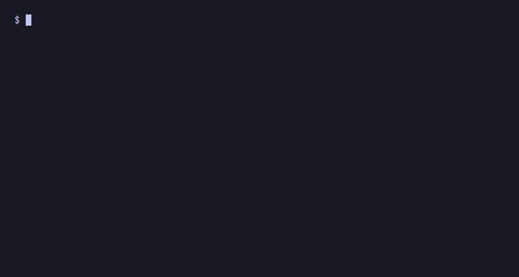

# GIF Recording Plan

## What this folder is

A minimal Django project used exclusively to record the README demo GIF. It has three local apps — `accounts`, `billing`, `blog` — with realistic migrations, plus `django_completion` in `INSTALLED_APPS`. It uses the same venv as the main project (`../.venv`).

## What the GIF shows

Three beats, total ~11 seconds, dark terminal, zsh shell with descriptions.

**Beat 1 — commands (~1.5s)**
```
$ python manage.py <TAB>
```
→ Shows the full command grid (31 commands). Establishes that the library knows your whole project.

**Beat 2 — migrate app labels (~2.5s)**
```
$ python manage.py migrate <TAB>
```
→ Shows `accounts [local]`, `billing [local]`, `blog [local]`, then `auth [pip]`, `contenttypes [pip]`. Local apps appear first.

**Beat 3 — migration names (~3.5s)**
```
$ python manage.py migrate accounts <TAB>
```
→ Shows `0001_initial`, `0002_add_profile`, `zero`. This is the hook — nobody else does this.

## Step-by-step to record

### 1. Install vhs

```bash
# macOS
brew install vhs

# Linux / anywhere with Go
go install github.com/charmbracelet/vhs@latest
```

vhs must be on your PATH.

### 2. Install django-completion for zsh

From the project root (not the demo folder):

```bash
python manage.py autocomplete install --shell zsh
```

This writes `~/.local/share/django-completion/completion.zsh` and adds a source block to your `~/.zshrc`. The tape sources that file directly, so this step must be done first.

### 3. Record

```bash
cd /path/to/django-completion/demo
vhs demo.tape
```

The GIF is written to `demo/demo.gif`. The terminal output during recording is normal — vhs renders it internally.

### 4. Embed in README

Once happy with the result, copy `demo.gif` to the repo root (or `docs/`):

```bash
cp demo/demo.gif demo.gif
```

Then in `README.md`:

```markdown

```

---

## What the tape does internally

The tape (`demo.tape`) has a hidden setup section and a visible recording section.

**Hidden section (not in GIF):**
1. Activates `../.venv` (the main project venv).
2. Initialises zsh completion system (`compinit`).
3. Sources `~/.local/share/django-completion/completion.zsh`.
4. Runs `python manage.py autocomplete refresh` to build the cache.
5. Sets `LISTMAX=0` so zsh never asks "show all X possibilities?".
6. Sets a minimal prompt: `$ `.
7. Clears the screen.

**Visible section (in GIF):**
- Beat 1: types `python manage.py `, presses Tab, waits 1.5s, Ctrl+C.
- Screen cleared (hidden).
- Beat 2: types `python manage.py migrate `, presses Tab, waits 2.5s, Ctrl+C.
- Screen cleared (hidden).
- Beat 3: types `python manage.py migrate accounts `, presses Tab, waits 3.5s, ends.

---

## If something goes wrong

**Completions don't appear at all**

The completion script isn't sourced or the cache is missing. Check:
```bash
ls ~/.local/share/django-completion/completion.zsh   # must exist
ls demo/.django-completion-cache.json                # must exist
```
If either is missing, re-run `python manage.py autocomplete install --shell zsh` then `python manage.py autocomplete refresh` from inside `demo/`.

**Beat 1 looks too cluttered**

31 commands in a small grid can be hard to read. You have two options:

Option A — remove Beat 1 entirely. Open `demo.tape` and delete these lines:
```
# Beat 1 — command completion
Type "python manage.py "
Tab
Sleep 1500ms
Ctrl+C

Hide
Type "clear" Enter
Sleep 200ms
Show
```
The GIF then starts straight at Beat 2, which is cleaner and still tells the story.

Option B — increase terminal height. Change `Set Height 460` to `Set Height 600` at the top of `demo.tape`.

**zsh asks "do you wish to see all X possibilities?"**

`LISTMAX=0` in the hidden setup should prevent this. If it still appears, add `setopt LIST_PACKED` after the `LISTMAX` line in `demo.tape`:
```
Type "setopt LIST_PACKED" Enter
```

**`source ../.venv/bin/activate` fails**

You ran `vhs demo.tape` from the wrong directory. Must be run from inside `demo/`:
```bash
cd demo
vhs demo.tape   # not: vhs demo/demo.tape from project root
```

**Typing looks too fast or too slow**

Change `Set TypingSpeed 50ms` at the top of `demo.tape`. Higher = slower (e.g. `80ms`), lower = faster (e.g. `30ms`).

**Read time on a beat is too short**

Adjust the `Sleep` value after each `Tab` press. For example to give Beat 3 five seconds to read:
```
Sleep 5000ms
```

---

## Demo project structure (for reference)

```
demo/
├── manage.py
├── demo.tape
├── .gitignore          (ignores db.sqlite3)
├── config/
│   ├── __init__.py
│   └── settings.py     (INSTALLED_APPS: contenttypes, auth, staticfiles, accounts, billing, blog, django_completion)
├── accounts/
│   ├── __init__.py
│   ├── apps.py
│   └── migrations/
│       ├── __init__.py
│       ├── 0001_initial.py
│       └── 0002_add_profile.py
├── billing/
│   ├── __init__.py
│   ├── apps.py
│   └── migrations/
│       ├── __init__.py
│       ├── 0001_initial.py
│       └── 0002_add_subscription.py
└── blog/
    ├── __init__.py
    ├── apps.py
    └── migrations/
        ├── __init__.py
        ├── 0001_initial.py
        ├── 0002_add_slug.py
        └── 0003_add_published_at.py
```

The cache at `demo/.django-completion-cache.json` is gitignored (covered by the root `.gitignore`). The GIF output `demo/demo.gif` is not gitignored — commit it once you are happy with it.
